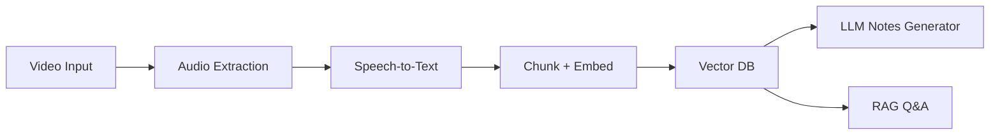

# 🚀 Deep-Dive Video Note Taker
`LLM + RAG`
<div align="center">

<h3>🎥 Local Video → Structured Notes + Timestamps + Action Items + RAG Q&A</h3>

<p>
<strong>CPU-only • Privacy-First • Offline-Capable • LLM Powered</strong>
</p>

<p>


</p>

<p><em>Convert long YouTube videos, lectures, and meetings into structured knowledge — locally.</em></p>

</div>

---

<hr>

## 🔎 What Is This?

**Deep-Dive Video Note Taker (Lite)** is a local AI system that converts long videos into:

<ul>
<li>📌 Structured notes</li>
<li>⏱️ Key timestamps</li>
<li>✅ Action items</li>
<li>🧠 RAG-based Q&A with citations</li>
</ul>

No cloud upload required. Everything runs locally using:

* whisper.cpp
* sentence-transformers
* ChromaDB
* Ollama (LLM)

---

## 🧠 Architecture Overview



---

## ✨ Core Features

<div style="background:#f6f8fa;padding:15px;border-radius:8px">

### 🎥 Input

* YouTube URL
* Local video file
* Batch processing

### 📝 Output

* Structured summary
* Multi-level notes
* Timestamped highlights
* Action item extraction
* Export to Markdown / JSON / Obsidian / Notion

### 🧠 Intelligence Layer

* Semantic chunking
* Embedding-based retrieval
* RAG pipeline
* Citation-backed answers

</div>

---

## ⚡ Quick Start

### 1️⃣ Install Dependencies

```bash
pip install poetry
poetry install
```

### 2️⃣ Install Ollama Model

```bash
ollama pull llama3.1:8b
```

### 3️⃣ Process a Video

```bash
poetry run notetaker process "https://www.youtube.com/watch?v=VIDEO_ID"
```

### 4️⃣ Ask Questions (RAG)

```bash
poetry run notetaker query VIDEO_ID "What were the main insights?"
```

---

## 🌐 Web UI + REST API

Start server:

```bash
poetry run notetaker serve
```

Open:

* Web UI → [http://localhost:8000](http://localhost:8000)
* Health → [http://localhost:8000/health](http://localhost:8000/health)

### API Endpoints

```http
POST   /api/process
POST   /api/process/upload
GET    /api/status/{job_id}
GET    /api/notes/{video_id}
GET    /api/transcript/{video_id}
POST   /api/query/{video_id}
GET    /api/library
GET    /api/export/{video_id}?format=json|markdown|obsidian|notion
DELETE /api/video/{video_id}
```

---

## 📦 Tech Stack

<div style="display:grid;grid-template-columns:repeat(auto-fit,minmax(200px,1fr));gap:10px">

<div style="background:#f0f0f0;padding:10px;border-radius:6px">
<strong>Speech-to-Text</strong><br>
whisper.cpp
</div>

<div style="background:#f0f0f0;padding:10px;border-radius:6px">
<strong>Embeddings</strong><br>
sentence-transformers
</div>

<div style="background:#f0f0f0;padding:10px;border-radius:6px">
<strong>Vector DB</strong><br>
ChromaDB
</div>

<div style="background:#f0f0f0;padding:10px;border-radius:6px">
<strong>LLM</strong><br>
Ollama (llama3.1:8b)
</div>

</div>

---

## ⚙️ Configuration

User config:

```
~/.notetaker/config.yaml
```

Environment variables:

```
NOTETAKER_OLLAMA_BASE_URL
NOTETAKER_OLLAMA_MODEL
NOTETAKER_WHISPER_MODEL
NOTETAKER_DATA_DIR
NOTETAKER_NOTION_API_KEY
```

---

## 📤 Exports

* JSON
* Markdown
* Obsidian (YAML + callouts)
* Notion blocks JSON

---

## 🐳 Docker
>>>>>>> 616c1cd67989d249b65f389c41c07adef4738747

```bash
docker compose up --build
```

<<<<<<< HEAD
This starts the web server on port 8000 with an Ollama sidecar. Services include healthchecks and dependency ordering. Set `NOTETAKER_OLLAMA_BASE_URL` if Ollama runs on a different host.

### Docker details

- **Dockerfile**: Multi-stage build with Node.js (for yt-dlp), FFmpeg, and a healthcheck endpoint.
- **docker-compose.yml**: Two services (`notetaker` and `ollama`) with healthchecks, volume mounts, and `depends_on` conditions.
- **.dockerignore**: Excludes `__pycache__`, `.git`, test artifacts, and local data.

## CI/CD

GitHub Actions workflow (`.github/workflows/ci.yml`) runs on every push and PR:

1. **Lint** -- ruff check + ruff format check
2. **Test** -- pytest across a matrix of 3 OS (Ubuntu, macOS, Windows) x 3 Python versions (3.10, 3.11, 3.12)
3. **Docker build** -- verifies the Docker image builds successfully

## Project Structure

```
src/notetaker/
  pipeline/         # 5-stage processing pipeline
    audio.py          # Stage 1: Audio extraction
    transcribe.py     # Stage 2: Whisper transcription
    embed.py          # Stage 3: Chunking + embedding + ChromaDB
    generate.py       # Stage 4: LLM structured note generation
    qa.py             # Stage 5: RAG Q&A
    runner.py         # Pipeline orchestrator (resume, profiling)
  storage/          # Data persistence layer
    cache.py          # Transcript + LLM output caching
    chroma.py         # ChromaDB wrapper
    library.py        # Multi-video library management
  api/              # FastAPI REST API
    app.py            # Application factory + favicon route
    routes.py         # All endpoints (incl. obsidian/notion export)
    tasks.py          # Background job manager
  export/           # Export modules
    markdown.py       # Markdown export
    json_export.py    # JSON export
    obsidian.py       # Obsidian export (YAML frontmatter, callouts)
    notion.py         # Notion blocks export + API integration
  web/              # Frontend SPA
    templates/        # Jinja2 HTML templates
    static/           # CSS, JavaScript, favicon
  utils/            # Shared utilities
    logging.py        # Structured logging
    validators.py     # Input validation
    download.py       # yt-dlp download helpers
    profiler.py       # Performance profiling (timing, memory)
  cli.py            # Typer CLI (process, batch, query, list, serve, config)
  config.py         # YAML config loader + env var overrides
  models.py         # Pydantic data models
tests/              # Unit tests (200+)
  evaluation/       # WER, ROUGE, BERTScore, RAG quality scripts
scripts/            # Setup and evaluation helpers
```

## Testing

```bash
poetry run pytest -v
```
Lint:

```bash
poetry run ruff check .
```

---

## 🤝 Contributing

PRs welcome.

1. Fork
2. Create branch
3. Add tests
4. Open PR

---

## 📄 License
>>>>>>> 616c1cd67989d249b65f389c41c07adef4738747

MIT
